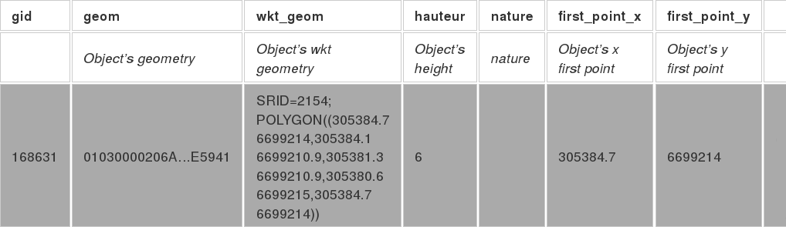
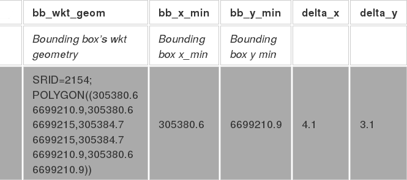

## From BDTopo to a 3DTile server

In this part, we will focus on how to extract the relevant data from the building set in BDTopo and deal with missing information. The final goal is to fill all the required fields in a 3D Tile.

### Description of BDTopo "Bati"

> **Source** : the BDTopo extract that we have used as a basis for our study is freely available at [IGN](http://professionnels.ign.fr/bdtopo#tab-1), along with a 200pp document describing the source of data and the meaning of each data attributes.

The **"E_BATI"** dataset contains 12 types of buildings (from "industrial" to "graveyard").  They all have the same set of attributes but, for simplicity we only focused on a few buildings. These are : **"BATI_INDUSTRIEL"**, **"BATI_REMARQUABLE"**, **"BATI_INDIFFERENCIE"**, **"CIMETIERE"**, **"LEGERE"**, **"RESERVOIR"**, **"TERRAIN_SPORT"**.

Definition of the attributes:
- **ID** : unique id
- **PREC_PLANI** and **PREC_ALTI**: respectfully for the precision in positioning and the precision in altitude. The latter depends on the data source (*cadastre* or other)
- **ORIGIN_BAT**: the origin of the data (example : *cadastre*)
- **HAUTEUR**: height of the building
- **Z_MIN** and **Z_MAX**: minimum and maximum height at the gutter level (basically at the base of the roof). For "TERRAIN_SPORT", these fields are replaced by **"Z_MOYEN"**.

> **Note**: The data imported from the *casdastre* has better 2D description and is more detailed than the other data (which have better 3D description and positioning) - *see p82 of BDTOPO_description manual version 2.2*

In addition to those fields, the BDTopo extract that we have provides a geometry:
- **wkt_geom** : MultiPolygonZM data with (x,y) in the metric system (Lambert93), and z as the height of the building from sea-level. It provides a full description of the bounding upper surface of the object.

The illustration shows all the data available (from the subset of "E_BATI")


### What is a 3DTile ?

> **Note**: A thorough study of the strenght and current status of Cesium's proposal regarding 3D Tile as a standard can be found in annex (see document: [Summary of Cesium 3D tiles standard proposal](../Annexe/3DTileDefinition.md)). It also provides links to relevant Cesium webpages.

3DTile is an open source specification built on top of glTF (GL Transmission format). glTF is a very efficient way for transmitting and loading 3D content (as a binary stream). More information can be found in annex : [Description of glTF](../Annexes/glTF.md).

3D Tile adds, among other things, spatial information and a hierarchy between objects.

In 3D Tiles, a **tileset** is a set of **tiles** organized in a spatial data structure, the **tree**. A tile references a **feature** or set of features, such as 3D models. The **metadata** for each tile - not the actual contents - are defined in JSON, as well as the tileset.

In summary, one tile description includes:
- a tile.json with a bounding box definition, information necessary to handle a Hierarchical Level of Detail (HLOD).
- a binary file with the description of the object and possibly some textures.

Among the possibilities, **Batched 3D Models** is the best way to describe a building. This format is described in annex : [Description of B3DM](../Annexes/b3dm.md).

### How (hierarchy and optimization) ?

> Note inclure texte de Samuel

### How to actually create  a BDTopo building into a 3D Tile building

> **TODO** changer titre

In this part, we describe the necessary steps to build a 3D Tile object. First, some preliminary work has to be done to present the data in a usable format. The goal is to be able to automate as mush as possible the process.

#### Input Data : BDTopo

BDTopo is a Shapefiles group with roads, energy network, hydrography, constructions, vegetation, etc...

A PostGIS database is created with all the building shapes into a unique table. Then, we can make build a set of SQL request to transform the IGN data into almost ready to use 3DTile data. For instance, a bounding box enclosing the object, coordinates in degrees, etc.

The BDTopo Bati entities geometry type is **MultiPolygonZM**: a 4D geometry, which is a 3D object (x,y,z) and m (for measurement) as a 4th dimension, which can be time or speed.

We simplified the geometry because the 4th dimension have no use for 3D Tiles, and transformed it into a simpler type: **PolygonZ**.

#### Importation into a PostGIS DB

The best way to import the shapefiles into the postgresql database is using a tool named "shp2psql", which is in the *postgis* package.
```
shp2pgsql -S -s {SRID} -W "{encoding}" -a file.shp schema.table | 
psql -d data_base -h host -U user
```

The created table for *bati* is : 
```
CREATE TABLE topo_bati
(
  gid serial NOT NULL,
  id character varying(24),
  geom geometry(PolygonZ,2154),
  prec_plani double precision,
  prec_alti double precision,
  origin_bat character varying(8),
  nature character varying(255) DEFAULT NULL,
  hauteur smallint,
  z_min double precision,
  z_max double precision,
  CONSTRAINT topo_bati_pkey PRIMARY KEY (gid)
)
```

#### Prepare the data

Now we have all the *bati* into the database, but we need some informations more, like 

* the bounding box of each entity,
* the entity geometry,
* the entity placement with its bounding box.

**The bounding box**
To generate an object's bounding box, we can make it with : *ST_Envelope(geom)*. It must be in degrees system coordinates, so we have to transform the geometry into the target SRID.
We need the x min & y min of it.

**The entity**
We need the geometry in metric system, that is simple with data into *Lambert 93*.
It is necessary to know the distance between this object and its bounding box in meters, this is the reason of bounding box (x min, y min).

**The result format**

The illustration shows all the data available (from the subset of "E_BATI")




#### Filling a 3DTile

A
