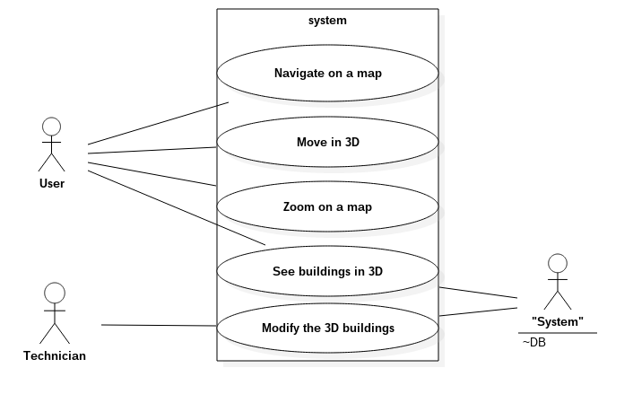
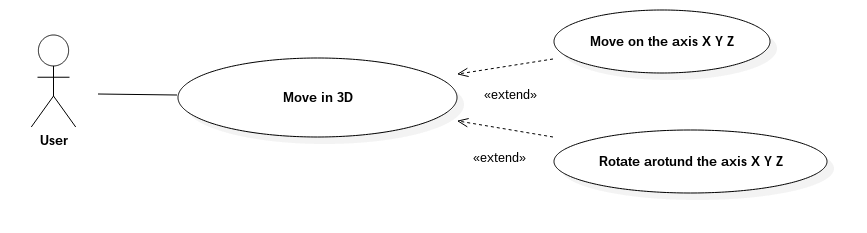
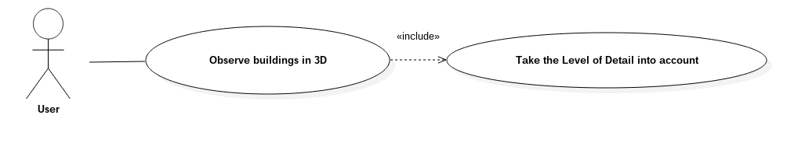
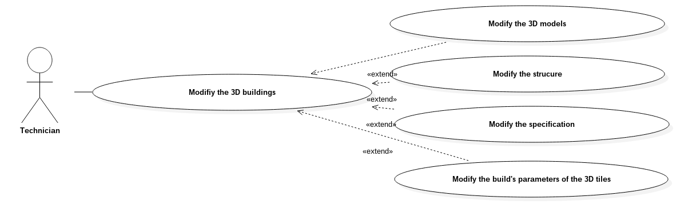

# Modelisation

## Use case diagrams  
We identify two users for our application:  
  - The general users    
  - The technicians    

Our application interacts with an external database that contains the 3DTiles

A user can navigate on a map, move in 3D, zoom on a map, see buildings in 3D.

A technician can modify the buildings.

You can find this information in our use case diagram:  
  

To move in 3D, the user can translate on the axis X,Y,Z and rotate around these axis:  
  

To see buildings in 3D, the system takes the Level of Details in account:   
  

When the technician modifies a building, he can modify the 3D model , the structure, the specification of the building and the build's paramters of the 3D tiles:  
  

You can see our complete use case diagram in the annexes.
