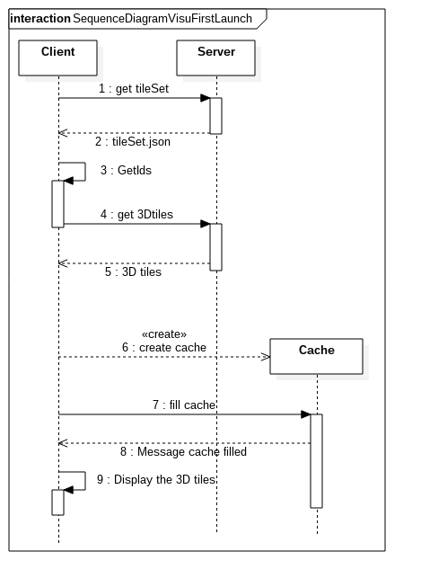

### Sequence diagrams  
Here, we will present how we imagine the opening of the data

#### On the first launch  
This is the sequence diagram that presents how the application reacts on the first launch:  

First the client sends a request to the server to get the tileSet.json that describes how the data are cut.

The using the bounding box of the screen, the client finds the IDs of the 3DTiles that he needs to ask to the server. When he recoveres the IDs, he sends a request to the server. The server's response is the 3DTiles that match the IDs.

Thererupon the client creates the cache and fills it with the 3DTiles received by the server.

Finally the client displays the 3DTiles on the screen.

#### On move  
This is the sequence diagram that presents how the application reacts when the user moves on the map:  

When the user moves on the map, the client finds the IDs of the 3DTiles that he needs to ask to the server. When he recoveres the IDs, he interogates the cache to know if it contains all, some or all the 3DTiles.

If the cache contains all the 3DTiles, the client displays these tiles.

Else, the client recovers the IDs of the missing 3Dtiles and sends a request to the server. The server's response is the 3DTiles that match the IDs. Thererupon the client fills the chache with the 3DTiles received by the server. Finally the client displays the 3DTiles on the screen.
