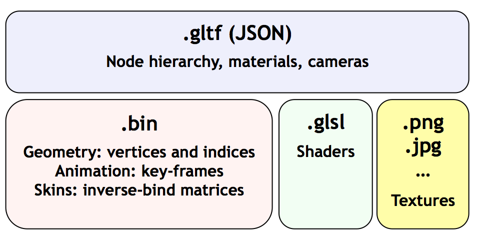

# glTf

> Taken from [KhronosGroup/glTF/README.md](https://github.com/KhronosGroup/glTF/blob/master/README.md)

glTF™ 1.0 (GL Transmission Format) is a royalty-free specification for the efficient transmission and loading of 3D scenes and models by applications. glTF minimizes both the size of 3D assets, and the runtime processing needed to unpack and use those assets. glTF defines an extensible, common publishing format for 3D content tools and services that streamlines authoring workflows and enables interoperable use of content across the industry.

> Taken from [AnalyticalGraphicsInc/3d-tiles](https://github.com/AnalyticalGraphicsInc/3d-tiles)

## What is the relationship between glTF and 3D Tiles ?

[glTF](https://www.khronos.org/gltf), the runtime asset format for WebGL, is an open standard for 3D models from Khronos (the same group that does WebGL and COLLADA). Cesium uses glTF as its 3D model format, and the Cesium team contributes heavily to the glTF spec and open-source COLLADA2GLTF converter. The use of glTF is recommended in Cesium for individual assets, e.g., an aircraft, a character, or a **3D building**.
 
3D Tiles are created for streaming massive geospatial datasets where a single glTF model would be prohibitive. Given that glTF is optimized for rendering, that Cesium has a well-tested glTF loader, and that there are existing conversion tools for glTF, 3D Tiles use glTF for some tile formats such as [b3dm](https://github.com/AnalyticalGraphicsInc/3d-tiles/blob/master/TileFormats/Batched3DModel/README.md) (used for 3D buildings).
 
Taking this approach allows to improve Cesium, glTF, and **3D Tiles** at the same time, e.g., when we add mesh compression to glTF, it benefits 3D models in Cesium, the glTF ecosystem, and 3D Tiles.

> Taken from [KhronosGroup/glTF/specification/1.0/README.md](https://github.com/KhronosGroup/glTF/blob/master/specification/1.0/README.md)

## Advantages

* glTF bridges the gap between 3D content creation tools and modern GL applications by providing an efficient, extensible, interoperable format for the transmission and loading of 3D content.
* glTF provides a vendor- and runtime-neutral format that can be loaded and rendered with minimal processing.
* glTF is able to faithfully preserve full hierarchical scenes with nodes, meshes, cameras, materials, and animations, while enabling efficient delivery and fast loading.
* The glTF JSON file itself is clear text, but it is compact and rapid to parse. All large data such as geometry and animations are stored in binary files that are much smaller than equivalent text representations.
* glTF data structures have been designed to mirror the GL API data as closely as possible, both in the JSON and binary files, to reduce load times. For example, binary data for meshes can be loaded directly into WebGL typed arrays with a simple data copy; no parsing or further processing is required.
* glTF makes no assumptions about the target application or 3D engine. glTF specifies no runtime behaviors other than rendering and animation
* Complete 3D scene representation.
* glTF defines a mechanism that allows the addition of both general-purpose and vendor-specific extensions.
* glTF is already used by Oslandia.

## Warning

* glTF is not a streaming format.
* glTF is not intended to be human-readable.
* Version 1.0 of glTF does not define compression for geometry and other rich data.
