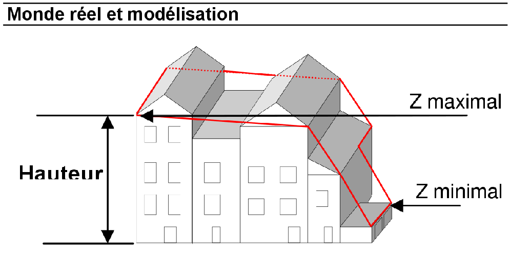
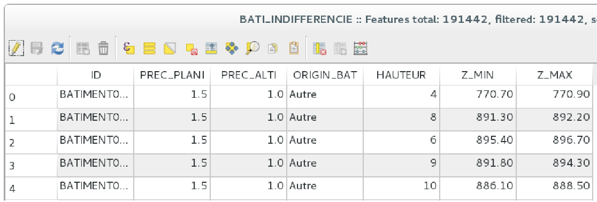

####Step 1:
Get the part of the BD Topo that you want transform into 3D Tiles.

####Step 2:
The classe (layer) which interests us is the “Bâti” classe which contains surface objects created thanks to orthoimagery.

####Step 3:
The attributes which describe the objects geometry are HAUTEUR, Z_MIN and Z_MAX

####Step 4:
Calculate the footprint of the building.
For each point of the geometry, keep the same coordinates (x,y) and affect a unique z:
z = z_maximal – hauteur

> http://professionnels.ign.fr/sites/default/files/DC_BDTOPO_2_1.pdf

> Extract of a “Bâti” layer from the  BDTopo in the Allier department

####Step 5:
Create a geographic BDD (geodatabse) thanks to PostGIS (in QGIS) which contains the attributes needed to create 3D Tiles building.
2 attributes for each 3D building: 
* ID (SERIAL PRIMARY KEY)
* GEOMETRY (POLYHERALSURFACEZ)     Note: description of the geometry thanks to four coordinates (x,y,z) 

####Step 6:
Use oslandia server to transform the PostGIS geodatabse into 3D Tiles (web).
It respects the BVH architecture (https://github.com/Oslandia/building-server).
Note: I followed the tutorial and I never succed to get 3D Tiles

Note: It also exists an other Oslandia tutorial. It explains how transform a CityGML file (XML) into a postGIS geodatabase which could be theoretically transform into a 3D Tiles.
